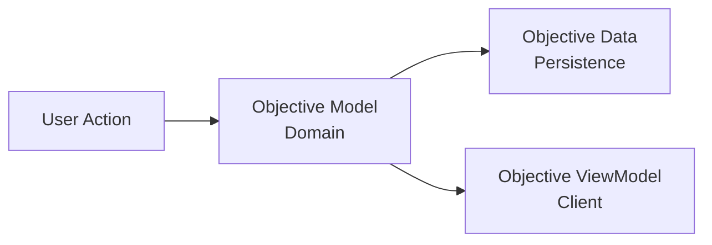

DATA FLOW
=========

During its lifecycle, data exists in three different representations: the domain layer, the persistence layer, and the client layer.

Domain Layer
------------

The domain layer contains the business logic of the application. It is mainly composed of use cases and entities.

A use case should not exist because a client needs an action for a specific screen. It should exist because it represents a meaningful capability of the application.

The domain layer should describe useful actions and processes that help users achieve their goals, independently of any user interface.

For example:

-   `GetAllObjectives` only exposes stored data.
-   `GetImportantObjectivesForToday` represents a business intention because it applies rules to determine which objectives need attention.

This is where data is in its **awake / working** state.

Persistence Layer
-----------------

The persistence layer is responsible for storing and retrieving data.

Repositories are the bridge between the domain and the storage. The domain should not know how data is stored or retrieved.

The persistence layer contains data in its **sleep** state.

Client Layer
------------

The client layer is responsible for presenting domain capabilities to the user.

It is a separate application built on top of the domain layer. It has its own constraints, such as performance, user experience, and rendering.

The client does not directly use domain data. It uses a representation adapted for the user interface: the **View Model**.

The client layer contains data in its **ready to be displayed** state.

Data Representation
-------------------

Example: defining a new objective.

Applications
------------

There are currently two software systems:

-   `apex-client`: the application used by the user.
-   `engine`: the library containing the core business logic.

The client is a complete application with its own architecture and data flow. It only consumes the capabilities provided by the engine.
